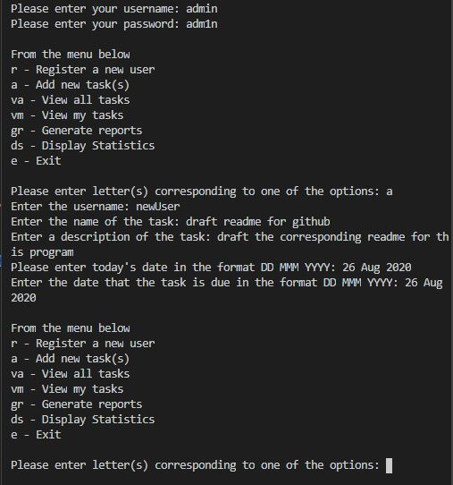
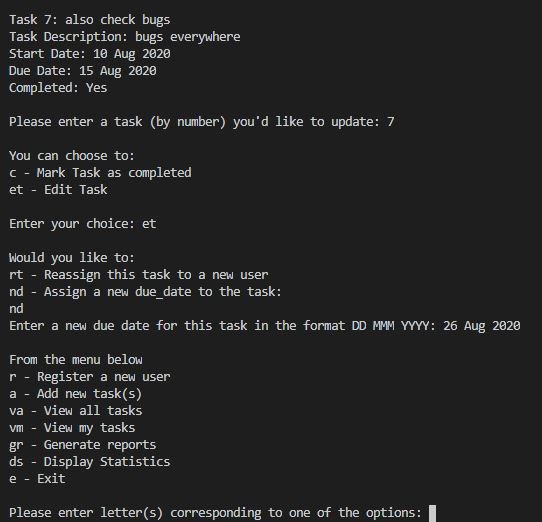
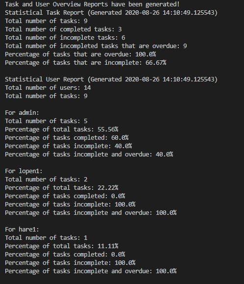

# Task Management System

## Description
This manages tasks for any small business. The task management program allows multiple users to log onto the system, add, update and mark tasks as completed. The admin
user has the added ability to get a display of overall task statistics. This program is useful to small business for tracking tasks carried out by their employees, which 
streamlines work flow by structuring what employees have to do and by when and thus make a more efficient business.

## Installation
This program is written in Python 3.7.0

1. Python will need to be installed on your machine:
https://www.python.org/downloads/release/python-370/

2. Click on the green CODE button at the top this repository and download the zip file
3. Keep the .txt files in the same folder as the task_manager.py
4. Open with an IDE or if you don't have any, use Python IDLE which is installed along with Python
5. Click Run from the menu

## Usage
When the program is run, the user is first required to logon. At this point, only username: admin with password: adm1n is stored in the external user.txt file. This can be used
to log in. The admin can then make new users and set passwords. The program ensures that new usernames have not been used previously. It also confirms that password entered 
is twice is the same. The user is then moved to the main menu where they are asked to select an option.

Once any option is completed, the program returns to the main menu until 'e' for exit is entered. Within the 'v - view my tasks' the user is also given further options.

Under gr - Generate reports, the program generates two reports for the user task_overview.txt and user_userview.txt files. The contents of these can be displayed for the admin 
user when they choose ds - 'Display Statistics'.

